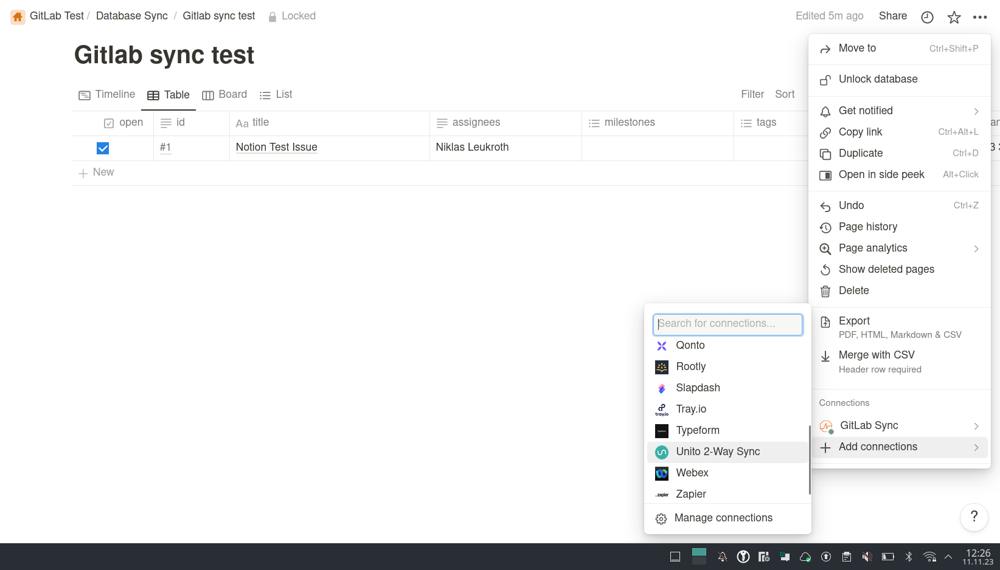

# GitLab Notion Issue sync
This projects mirrors the issues from a gitlab project to a notion database. Every time the script is run it will fetch all issues, milestones and labels from the project and insert or update ( depending on which one is necessary ) entries in the notion database.

## Setup
## Notion 

### Create an integration
Go to https://www.notion.so/my-integrations and create an integration that has the "Read content", "Update content" and "Insert content" capabilities. Copy it's secret and add it to your `.env` file on a new line.

`NOTION_KEY=<integration_secret>`


### Setup your Notion database

To run this script you will need to create a database in notion if you don't have one yet. The database needs to have the following columns:
| Name | Type |
| - | - |
| id | text |
| open | checkbox |
| title | title |
| assignees | text |
| timespan | date | 
| last_updated_at | date |
| tags | multi_select |
| milestones | multi_select |

> NOTE: The order is not important but the casing is

Next add your integration to the database, this can be done throught the menu in the top right corner of the database view.


Then click the "Share" button in the top right corner and copy the link. Your link should look something like this:

https://www.notion.so/abcdef?v=123456e

In this example the database id would be `abcdef`. Add this id to your `.env` file on a new line.

`NOTION_DATABASE_ID=<database_id>`


## GitLab

### Personal Access Token

To fetch the issues, milestones and labels from your project this script requires a gitlab Personal Access Token for your gitlab instance that has the `read_api` scope. You can create one by going to your user settings under the category "Access Tokens" and clicking "Add new token". Again add this id to your `.env` file on a new line.

`GITLAB_TOKEN=<your_personal_access_token>`

### Project ID

The gitlab Project ID can be found on its overview page ( https://git.example.com/group_name/project_name ) right below the project name.

`GITLAB_PROJECT_ID=<project_id>`

### GitLab domain

This script is designed to work with custom GitLab instances so you also need to add your domain to the `.evn` file.

`GITLAB_DOMAIN=<git.example.com>`


## .env File

In the end your `.env` file should look like this.
```env
NOTION_KEY=<integration_secret>
NOTION_DATABASE_ID=<database_id>

GITLAB_TOKEN=<your_personal_access_token>
GITLAB_PROJECT_ID=<project_id>
GITLAB_DOMAIN=<git.example.com>
```

## Running the script

> NOTE: This script is designed to work with NodeJS Version 16 or higher.
```
npm install
node index.js
```

## Troubleshooting
If the script throws an error most of the time the easiest solution is to just delete all entries in the table on notion. 

If the error still persist the second most common issue is caused by all tags or milestones still remaining in notion, to fix this you can edit the notion database by clicking the three dots on the top right corner of the view. Click on "Properties" and then first select "milestones" and remove all the options, then do the same thing for the "tags" property.